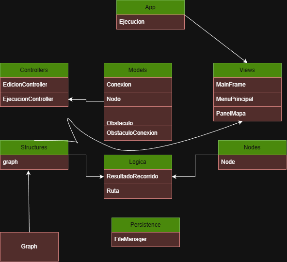

# Proyecto de Algoritmos BFS Y DFS en un Mapa

## 📌 Información General

- **Título:** Proyecto Final
- **Asignatura:** Estructura de Datos
- **Carrera:** Computación
- **Integrantes:** [Xavier Fajardo y ]
- **CorreoInstitucional:** [xfajardoz@est.ups.edu.ec ]
- **CorreoInstitucional:** [ ]
- **Fecha:** [3/02/2026]
- **Profesor:** Ing. Pablo Torres

---

## 🛠️ Descripción

  En muchos escenarios reales, como sistemas de navegación, planificación de rutas , es necesario modelar un conjunto de puntos conectados entre sí tipo grafo y encontrar caminos entre un punto de inicio y uno de destino.

    El problema consiste en diseñar un sistema que permita:

    -  Representar un mapa mediante nodos y conexiones.

    - Simular obstáculos que bloquean el paso.

    - Definir un nodo de inicio y uno de destino.

    - Aplicar algoritmos de recorrido de grafos (BFS y DFS).

    - Visualizar gráficamente el recorrido y el camino encontrado.

    El sistema debe permitir interacción gráfica, ser flexible ante distintos mapas y mostrar claramente el comportamiento de los algoritmos.

## Propuesta de solución
### 3.1 Marco teórico

#### Grafos

    Un grafo es una estructura de datos compuesta por:

    Nodos (vértices): representan puntos o estados.
    Aristas (conexiones): representan relaciones entre nodos.

    Formalmente, un grafo se define como:

    G = (V, E) donde: V es el conjunto de nodos y E es el conjunto de aristas

    En este proyecto, los nodos representan puntos del mapa y las aristas representan caminos transitables.

    Breadth First Search (BFS)

    El algoritmo BFS recorre el grafo por niveles, explorando primero todos los nodos vecinos antes de avanzar más profundo.

    Características:

    Utiliza una cola (Queue).
    Garantiza encontrar el camino más corto en grafos no ponderados.
    Consume más memoria.

    Depth First Search (DFS)

    El algoritmo DFS explora un camino hasta el final antes de retroceder.

    Características:

    Utiliza una pila (Stack) o recursión.
    No garantiza el camino más corto.
    Consume menos memoria.

## Tecnologías utilizadas
  - : 
    - Java 17+
    - Java Swing (interfaz gráfica)
    - Programación Orientada a Objetos
    - Estructuras de datos 
    - Java util
    - Archivos .txt para persistencia de coordenadas
 
## Diagrama UML 

   Explicacion General de algunas Clases

  - PanelMapa: se encarga de la visualización gráfica y la   interacción.
  - Nodo: representa un punto del mapa.
  - Graph y Node: representan la estructura del grafo.
  - EdicionController: controla los modos de edición.
  - EjecucionController: controla la ejecución de BFS y DFS.
  - Ruta: almacena el camino final encontrado.

## 🚀 Ejecución

Funcionamiento general del sistema

- El usuario selecciona un modo de edición (agregar nodo, obstáculo, etc.).
- Se crean nodos sobre el mapa gráfico.
- Los nodos se conectan formando un grafo.
- Se selecciona un nodo de inicio y uno de destino.
- Se elige el algoritmo (BFS o DFS).
- El sistema anima el recorrido paso a paso.
- Se muestra el resultado final con mensajes informativos.

## 🧑‍💻 Capturas del Proyecto en ejecucion

## Conclusión 
- Integrante Xavier Fajardo
    El desarrollo de un sistema de grafos en un mapa  permitió analizar de forma práctica las diferencias operativas entre los algoritmos BFS (Breadth First Search) y DFS (Depth First Search) bajo condiciones idénticas. Mientras que el BFS demostró su eficacia para localizar el camino más corto mediante una exploración estructurada por niveles siendo la opción predilecta para sistemas de navegación y optimización de rutas , el DFS exhibió un enfoque de exploración profunda que, aunque no garantiza la mínima distancia, resulta eficiente y sencillo para tareas de verificación de conectividad. Esta comparación directa evidenció que la elección del algoritmo depende estrictamente del contexto: el BFS es superior ante la necesidad de precisión y optimalidad en grafos complejos, mientras que el DFS es funcional en estructuras más simples o con menos ramificaciones. En última instancia, la implementación de una interfaz gráfica y animada no solo validó estas teorías, sino que reafirmó el valor de las herramientas visuales para convertir conceptos abstractos en experiencias de aprendizaje tangibles y comparables.
## 5. Recomendaciones y aplicaciones futuras

- Agregar guardado y carga de mapas completos.
- Implementar zoom y desplazamiento del mapa.
- Aplicar el sistema a:
- Algo del Mundo Actual de manera que facilite la vida de los ecuatorianos 
- Agregar mas recorridos y formas de hallar caminos 
- Videojuegos y simulaciones educativas.

